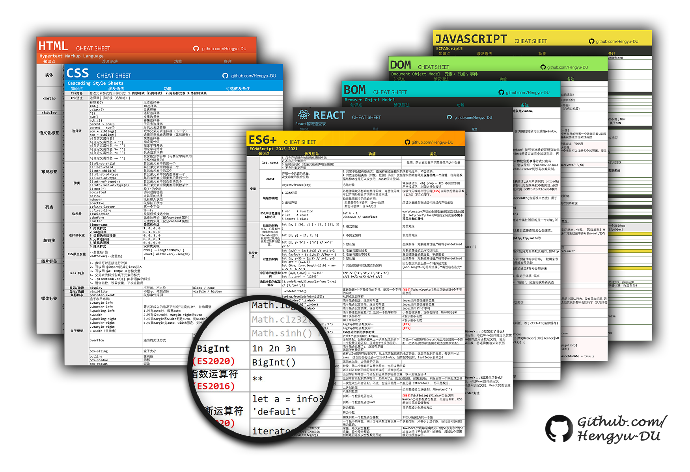

# HTML、CSS、JavaScript（DOM\BOM\ES6+）、React语法小抄

或许是第一份中文版的前端语法小抄（Cheat Sheet）了

## 缘起

在学习前端的过程中，随着知识越学越多，常常面临记不起曾经学过的某个语法点的尴尬。

经了解发现，很多初学者都会发生同样的“失忆”，国外有不少程序员整理了Cheat Sheet，即“作弊小抄”，将语法密密麻麻地写在纸上，“失忆”的时候就可以快速查找对应的语法。

作为一个强迫症和整理狂魔，在开发和学习中也整理了一套语法小抄，打印在手边，随时查阅。

## 内容

按语言和知识模块分为七份Cheat Sheet：

- HTML
- CSS
- JAVASCRIPT(ES5)
- DOM
- BOM
- ES6+
- REACT

## 使用

- 下载[PDF文件](https://github.com/Hengyu-DU/Front-end-Cheatsheets/tree/master/pdf)
- 打印
- 可用于语法速查、查漏补缺、面试复习

## 自定义

- 下载[XLSX文件](https://github.com/Hengyu-DU/Front-end-Cheatsheets/tree/master/xlsx)
- 自行修改内容