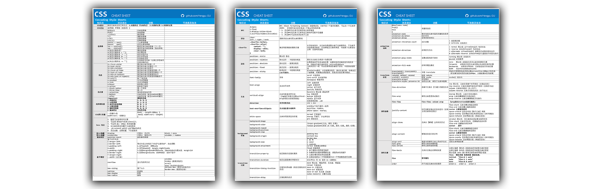
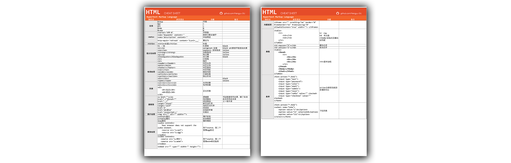
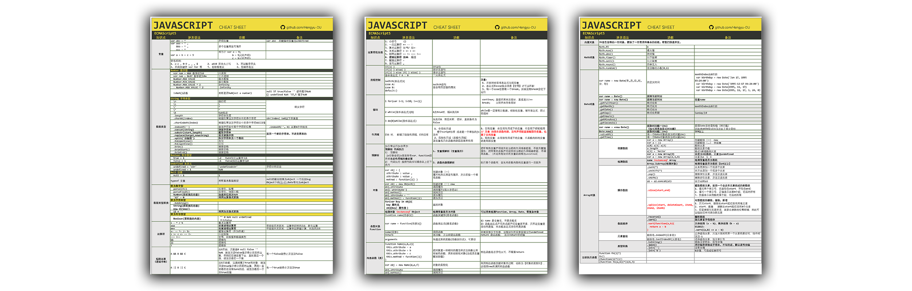
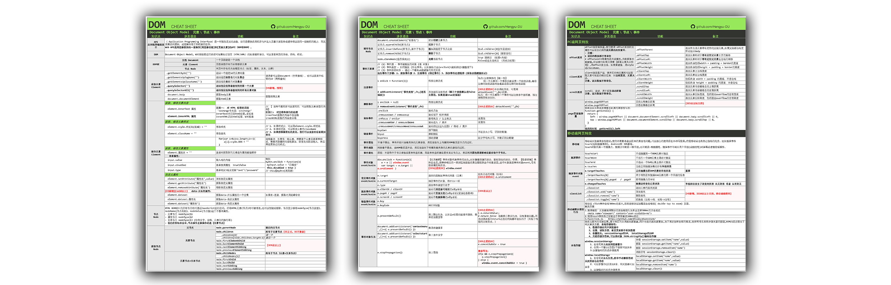
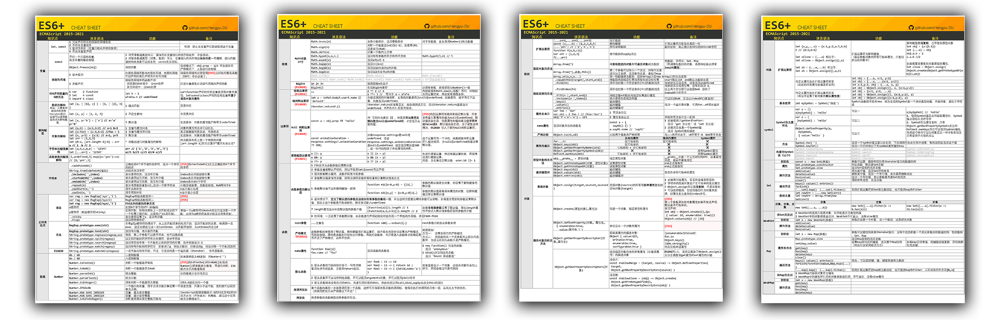

# HTML、CSS、JavaScript（DOM\BOM\ES6+）、React语法速查表

🆕第一份中文版的前端语法表，俗称小抄学习法，也称A4纸学习法（Cheat Sheet）。

（以下内容含图，没有科学上网的情况下可能无法正常显示）

## 介绍

随着知识越学越多，在没有复习的情况下，我们常常学了后面忘了前面😥。有国外的前端程序员整理了所谓的“作弊小抄”（Cheat Sheet），即将所有语法按规律整理在A4纸上，像极了高考前整理了一遍又一遍的知识笔记。这样的好处在于，可以快速复习✒和查找🔍某个语法，并且形成知识体系。

鉴于目前网上还没有中文版的“作弊小抄”，我将自己这六个月的学习成果整理了出来😘，参考了尚硅谷、黑马的HTML\CSS\JS课程，以及阮一峰老师的《ES6标准入门（第3版）》。在后来开发和学习的过程中，这套小抄给我提供了很大的便利👍，每次查阅，都在一次次地巩固我的记忆。

现在，经过精心地排版👑和美化，我将这份16页的小抄分享给大家，欢迎大家下载✅并打印🖨。

整理不易，也希望大家多多 star ⭐ 和 fork 🔧！

## 内容

按语言和知识模块分为七份Cheat Sheet：

- [HTML](https://github.com/Hengyu-DU/Front-end-Cheatsheets/blob/master/pdf/HTML%20pdf-version.pdf)
- [CSS](https://github.com/Hengyu-DU/Front-end-Cheatsheets/blob/master/pdf/CSS%20pdf-version.pdf)
- [JAVASCRIPT(ES5)](https://github.com/Hengyu-DU/Front-end-Cheatsheets/blob/master/pdf/JavaScript%20pdf%20version.pdf) - 3张图总结ES5核心语法
- [DOM](https://github.com/Hengyu-DU/Front-end-Cheatsheets/blob/master/pdf/JavaScript-DOM%20pdf%20version.pdf)
- [BOM](https://github.com/Hengyu-DU/Front-end-Cheatsheets/blob/master/pdf/JavaScript-DOM%20pdf%20version.pdf)
- [ES6+](https://github.com/Hengyu-DU/Front-end-Cheatsheets/blob/master/pdf/ES6%2B%20pdf-version.pdf) - 4张图记住ES6核心要点
- [REACT](https://github.com/Hengyu-DU/Front-end-Cheatsheets/blob/master/pdf/React%E5%9F%BA%E7%A1%80%20pdf%20version.pdf)

## 使用

- 下载[PDF文件](https://github.com/Hengyu-DU/Front-end-Cheatsheets/tree/master/pdf)
- 打印
- 可用于语法速查、查漏补缺、面试复习

## 自定义

- 下载[XLSX文件](https://github.com/Hengyu-DU/Front-end-Cheatsheets/tree/master/xlsx)
- 自行修改内容

## 英文版

- 一位来自加勒比海的大佬[@manz](https://twitter.com/Manz)整理好了JavaScript的核心语法（ES6+语法为主）
- 下载地址：manz的[个人网站](https://lenguajejs.com/cheatsheets/)
- 网站语言为西班牙语，可以用Chrome的翻译功能
- 注意：下载是免费的，不过会优先提示希望你为他的项目捐款

## 文件预览

（图片加载可能较慢，显示的速度取决于网速，请耐心等待）

### CSS

页数：3

### HTML

页数：2

### JAVASCRIPT (ES5)

页数：3

### DOM

页数：3

### BOM

页数：1

### ES6+

页数：4

### REACT

页数：3

>  [返回顶部](# HTML、CSS、JavaScript（DOM\BOM\ES6+）、React语法速查表) 

